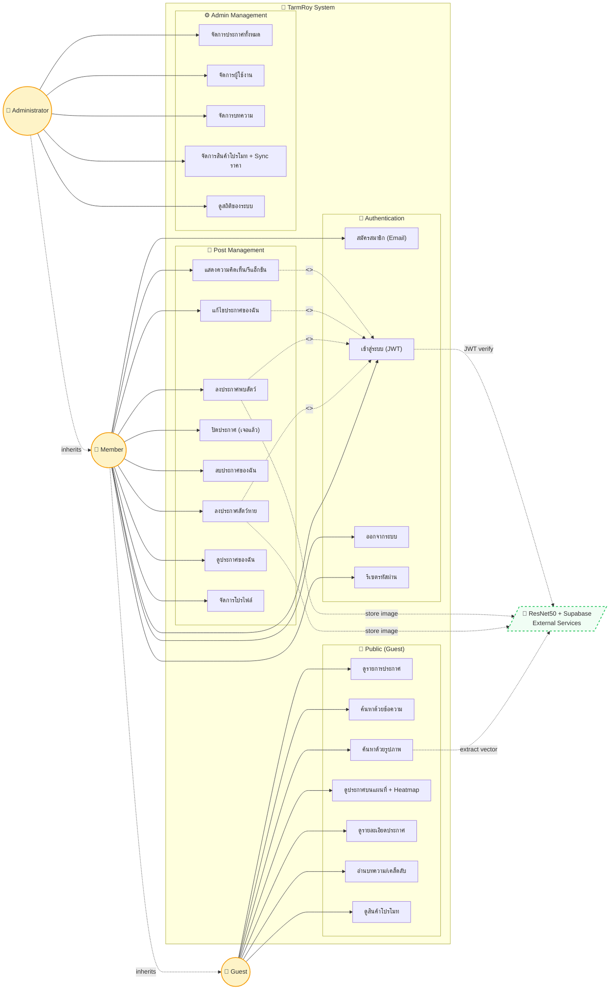
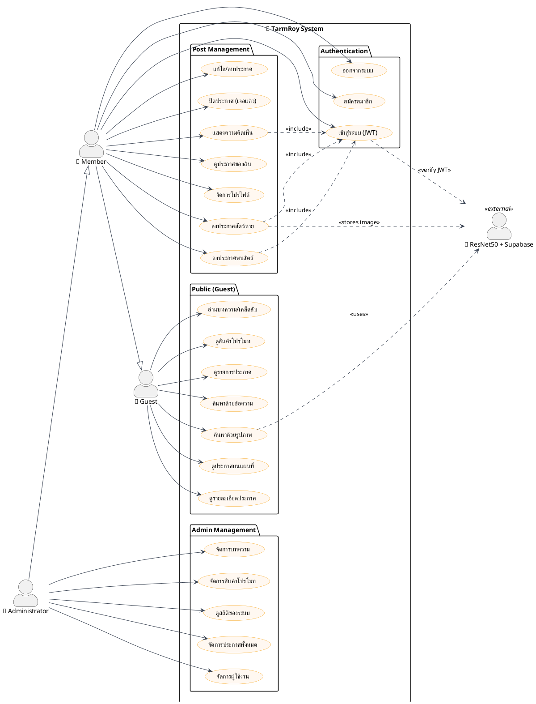
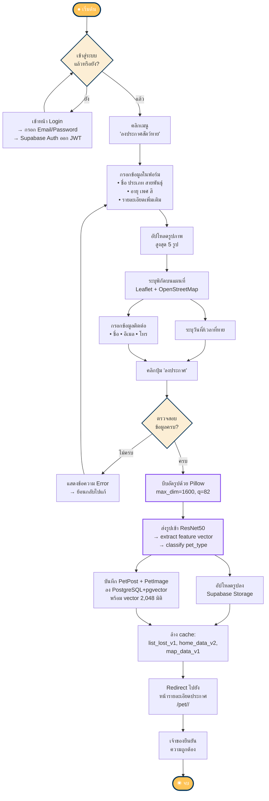
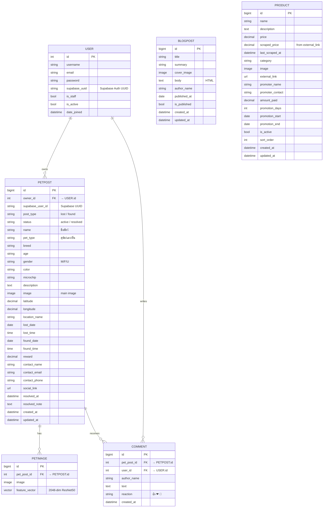
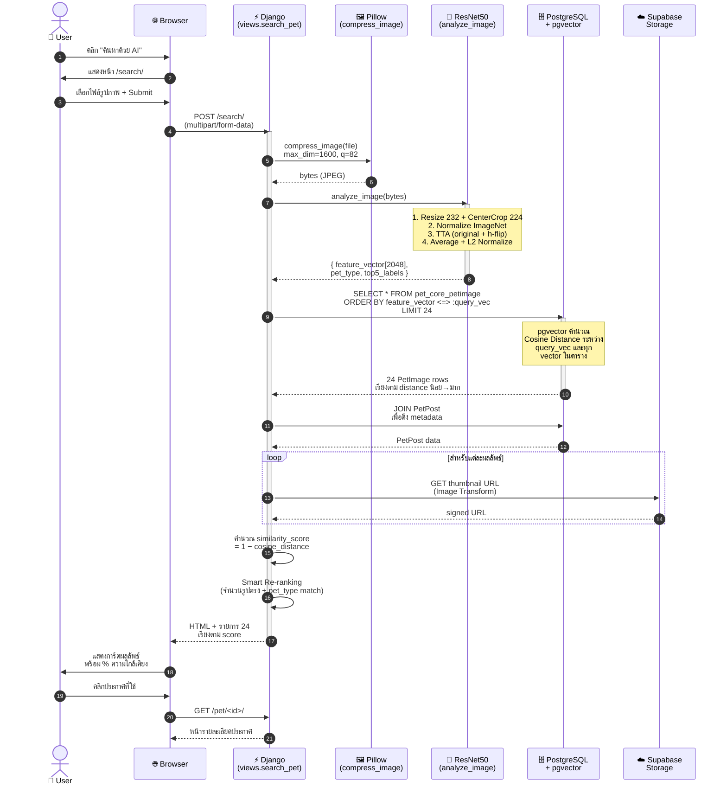

# TarmRoy — Diagrams (รูปที่ 3.1–3.4)

## วิธีดู
- **UseCase / Activity / Sequence / ER (Mermaid):** วางโค้ดใน [mermaid.live](https://mermaid.live) → กด **Actions → PNG** เพื่อ download
- **UseCase ทางเลือก (PlantUML):** ถ้าต้องการสไตล์ UML แบบมาตรฐาน ใช้ [plantuml.com/plantuml](https://www.plantuml.com/plantuml/uml/)

ตั้งความละเอียดที่ Mermaid Live ให้ใหญ่ขึ้น: **Actions → Configure → maxWidth: 2000** ก่อน export PNG

---

## รูปที่ 3.1  Use Case Diagram ของระบบ TarmRoy

### ตัวเลือก A — Mermaid (แนะนำสำหรับเลย์เอาต์เดียวกับเอกสาร)



### ตัวเลือก B — PlantUML (สไตล์ UML มาตรฐาน)



---

## รูปที่ 3.2  Activity Diagram การลงประกาศสัตว์หาย



---

## รูปที่ 3.3  E-R Diagram ของระบบฐานข้อมูล TarmRoy



> **หมายเหตุ:** `PETIMAGE.feature_vector` เป็นชนิดข้อมูล `vector(2048)` ของส่วนขยาย pgvector — รองรับการค้นหาแบบ Cosine Distance ผ่านตัวดำเนินการ `<=>` ส่วน BLOGPOST และ PRODUCT เป็น entity แยก ไม่มี FK เชื่อมกับ PETPOST/USER โดยตรง

---

## รูปที่ 3.4  Sequence Diagram การค้นหาด้วยรูปภาพ



---

## วิธีนำไปใช้

### Mermaid → PNG
1. ไปที่ https://mermaid.live
2. ลบโค้ดตัวอย่าง แล้ววาง code block ของ diagram ที่ต้องการ (เริ่มจากบรรทัดถัดจาก ` ```mermaid ` ถึงก่อน ` ``` `)
3. รอจน preview ขึ้นทางขวา
4. กด **Actions** ที่มุมขวาบน → **PNG** หรือ **SVG**
5. ตั้งชื่อไฟล์ตามรูปในรายงาน เช่น `figure_3_1_usecase.png`

### PlantUML → PNG
1. ไปที่ https://www.plantuml.com/plantuml/
2. วาง code block ของ PlantUML
3. กด **Submit** จะได้ภาพ PNG ทันที — กด save image as

### นำไปใส่ Word
1. เปิดไฟล์ `TarmRoy_รายงานโครงงาน2_ฉบับสมบูรณ์.docx` ใน MS Word
2. กด `Ctrl+F` หา Caption เช่น "**รูปที่ 3.1 Use Case Diagram ของระบบ TarmRoy**"
3. คลิกที่บรรทัดเหนือ Caption → **Insert → Pictures → This Device** → เลือก PNG
4. คลิกขวา → **Wrap Text → In Line with Text**
5. ปรับขนาดให้กว้างไม่เกิน 6 นิ้ว
6. จัดกึ่งกลาง (Ctrl+E)

---

## เทคนิคปรับสีให้เข้ากับเอกสาร TarmRoy

ถ้าต้องการสีตามแบรนด์ TarmRoy (Navy + Cream + Gold) เพิ่ม `%%{init: ...}%%` ที่บรรทัดแรกของ Mermaid:

```mermaid
%%{init: {'theme':'base', 'themeVariables': {
  'primaryColor': '#FCEED5',
  'primaryTextColor': '#003459',
  'primaryBorderColor': '#FEC356',
  'lineColor': '#003459',
  'secondaryColor': '#FFE7BA',
  'tertiaryColor': '#FFFFFF'
}}}%%
flowchart TD
  ...
```



วางบรรทัดนี้ก่อน `flowchart`/`erDiagram`/`sequenceDiagram` จะได้สีน้ำเงินกรมท่า + ครีม + เหลือง ตามแบรนด์ระบบ

---

ทุก diagram ออกแบบให้สอดคล้องกับเนื้อหาในรายงาน:
- **3.1 Use Case** — Actor 3 ระดับ (Guest → Member → Administrator) มี inheritance พร้อม external service (ResNet50 + Supabase)
- **3.2 Activity** — flow การลงประกาศสัตว์หายตั้งแต่ login → upload → ResNet50 → pgvector → cache invalidation → redirect
- **3.3 ER** — 6 entity ตรงกับ models.py (User, PetPost, PetImage, Comment, BlogPost, Product) ครบทุก field พร้อม FK และ cardinality
- **3.4 Sequence** — 6 lifeline (User, Browser, Django, Pillow, ResNet50, pgvector, Storage) แสดงทั้ง TTA, L2 normalize, cosine distance, smart re-ranking
